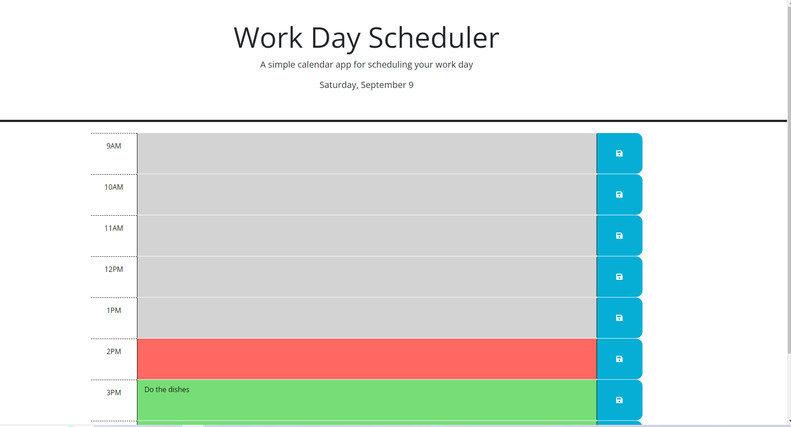

# Work-Day Scheduler 

Work-Day Scheduler is a simple calendar app that helps you schedule your work day. It allows you to create and save events for specific hours of the day, making it easier to manage your tasks and appointments.

## Usage

The Work-Day Scheduler is designed to be intuitive and user-friendly:

-The current date is displayed at the top of the calendar.
-Time blocks are color-coded:
   -Gray for past hours
   -Red for the present hour
   -Green for future hours
-You can enter and save events for each business hour (9am-5pm).

## Features

The Work-Day Scheduler comes with the following features:

- Current date display.
- Color-coded time blocks.
- Ability to enter and save events.
- Persistent storage of events using local storage. 

## Screenshot of Work-Day Scheduler

</img>